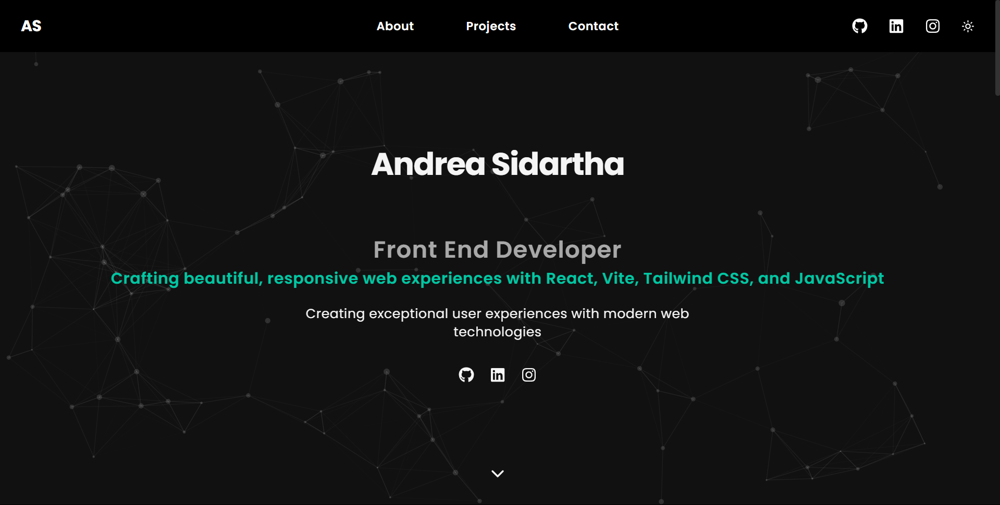

# Andrea Sidartha - Portfolio Website 🚀

A modern, responsive portfolio website built with React, Vite, and Tailwind CSS. Features smooth animations, dark/light theme toggle, interactive project gallery, and contact form integration.



## ✨ Features

- **Modern Design**: Clean, responsive design with smooth animations
- **Dark/Light Theme**: Toggle between dark and light modes
- **Interactive Gallery**: Modern image gallery with navigation for project screenshots
- **Contact Form**: Integrated EmailJS for seamless contact functionality
- **Smooth Animations**: Framer Motion animations for enhanced user experience
- **Mobile Responsive**: Optimized for all devices and screen sizes
- **Performance Optimized**: Fast loading with Vite build tool
- **SEO Friendly**: Proper meta tags and structured content

## 🛠️ Tech Stack

- **Frontend**: React 18, Vite
- **Styling**: Tailwind CSS
- **Animations**: Framer Motion
- **Icons**: React Icons, Lucide React
- **Contact**: EmailJS
- **Deployment**: Vercel (recommended)

## 🚀 Live Demo

Visit the live portfolio: [https://andreasidartha.github.io/portofolio/](https://andreasidartha.github.io/portofolio/)

## 📁 Project Structure

```
src/
├── components/          # React components
│   ├── About.jsx       # About section
│   ├── Contact.jsx     # Contact form
│   ├── Footer.jsx      # Footer component
│   ├── Hero.jsx        # Hero section
│   ├── Navbar.jsx      # Navigation bar
│   ├── Projects.jsx    # Projects showcase
│   └── ...
├── config/             # Configuration files
│   └── emailjs.template.js  # EmailJS template
├── context/            # React context
│   └── ThemeContext.jsx     # Theme management
├── assets/             # Images and assets
└── main.jsx           # Application entry point
```

## 🎯 Featured Projects

### 1. SUMS - Smart Utility Management System
- **Live Demo**: [https://sums-teal.vercel.app/](https://sums-teal.vercel.app/)
- **GitHub**: [https://github.com/andreasidartha/sums](https://github.com/andreasidartha/sums)
- **Description**: Comprehensive utility management platform for electricity, gas, and water services
- **Tech**: React, Tailwind CSS, JavaScript, Charts.js, Redux

### 2. DreShop - Premium E-commerce Platform
- **Live Demo**: [https://dreshop.vercel.app/](https://dreshop.vercel.app/)
- **GitHub**: [https://github.com/andreasidartha/dreshop](https://github.com/andreasidartha/dreshop)
- **Description**: Modern e-commerce platform with PWA capabilities and advanced features
- **Tech**: React, TypeScript, Tailwind CSS, Zustand, PWA

### 3. Eventure eTicket - Event Ticketing Platform
- **Live Demo**: [https://eventure-eticket.vercel.app/](https://eventure-eticket.vercel.app/)
- **GitHub**: [https://github.com/andreasidartha/eventure-eticket](https://github.com/andreasidartha/eventure-eticket)
- **Description**: Modern event ticketing platform with secure checkout and admin dashboard
- **Tech**: React, Vite, Tailwind CSS, JavaScript

## 🚀 Getting Started

### Prerequisites

- Node.js (version 16 or higher)
- npm or yarn

### Installation

1. **Clone the repository**
   ```bash
   git clone https://github.com/andreasidartha/portofolio.git
   cd portofolio
   ```

2. **Install dependencies**
   ```bash
   npm install
   ```

3. **Set up EmailJS (optional)**
   - Copy `src/config/emailjs.template.js` to `src/config/emailjs.js`
   - Replace placeholder values with your EmailJS credentials
   - Follow the setup guide in the template file

4. **Start development server**
   ```bash
   npm run dev
   ```

5. **Open your browser**
   Navigate to `http://localhost:5173`

## 📦 Available Scripts

- `npm run dev` - Start development server
- `npm run build` - Build for production
- `npm run preview` - Preview production build

## 🎨 Customization

### Personal Information
Update the following files with your information:
- `src/components/Hero.jsx` - Name and title
- `src/components/About.jsx` - About description
- `src/components/Projects.jsx` - Project details and links
- `src/components/Contact.jsx` - Contact information

### Styling
- Colors: Update Tailwind config in `tailwind.config.js`
- Theme: Modify `src/context/ThemeContext.jsx`
- Animations: Adjust Framer Motion settings in components

### Projects
- Add your project screenshots to `assets/` folder
- Update project information in `src/components/Projects.jsx`
- Configure gallery settings for project showcases

## 🔧 EmailJS Setup

1. Sign up at [EmailJS](https://www.emailjs.com/)
2. Add your email service (Gmail, Outlook, etc.)
3. Create an email template with variables: `{{from_name}}`, `{{from_email}}`, `{{message}}`
4. Copy your Service ID, Template ID, and Public Key
5. Update `src/config/emailjs.js` with your credentials

## 🌟 Key Features Explained

### Interactive Gallery
- Modern modal-based image gallery
- Keyboard navigation (arrow keys, escape)
- Auto-play slideshow functionality
- Thumbnail navigation
- Smooth transitions and animations

### Theme Toggle
- Persistent theme preference
- Smooth transition between themes
- System theme detection
- Accessible toggle controls

### Responsive Design
- Mobile-first approach
- Optimized for all screen sizes
- Touch-friendly interactions
- Performance optimized

## 📱 Browser Support

- Chrome (latest)
- Firefox (latest)
- Safari (latest)
- Edge (latest)

## 🤝 Contributing

1. Fork the repository
2. Create a feature branch (`git checkout -b feature/amazing-feature`)
3. Commit your changes (`git commit -m 'Add some amazing feature'`)
4. Push to the branch (`git push origin feature/amazing-feature`)
5. Open a Pull Request

## 📄 License

This project is licensed under the MIT License - see the [LICENSE](LICENSE) file for details.

## 📞 Contact

- **GitHub**: [@andreasidartha](https://github.com/andreasidartha)
- **LinkedIn**: [Andrea Sidartha](https://linkedin.com/in/andrea-sidartha)
- **Instagram**: [@andreasidartha](https://instagram.com/andreasidartha)

## 🙏 Acknowledgments

- **Framer Motion** for smooth animations
- **Tailwind CSS** for utility-first styling
- **React Icons** for beautiful icons
- **EmailJS** for contact form functionality
- **Vite** for fast development experience

---

**Built with ❤️ by Andrea Sidartha**

⭐ If you find this portfolio helpful, please give it a star! 